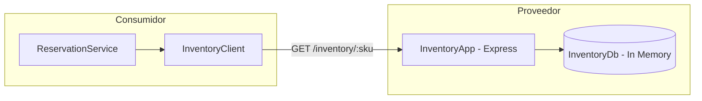

# Consumer-Driven Contract Testing (PactV3 + Vitest)

Este proyecto demuestra una arquitectura completa e implementación de **Consumer-Driven Contract Testing (CDCT)** utilizando **TypeScript**, la API de **PactV3** (`@pact-foundation/pact`), **Vitest** como runner de pruebas, y una suite de **GitHub Actions** para integración continua.

---

## 🏗️ Arquitectura del Sistema

El sistema se compone de dos aplicaciones/servicios independientes dentro de una arquitectura orientada a servicios (SOA / Microservicios):



1. **Cliente Consumidor (`ReservationService`):**
   - Servicio encargado de procesar solicitudes de reserva de productos.
   - Utiliza `InventoryClient` (basado en `fetch` de Node.js) para consultar la disponibilidad en el servicio de inventario antes de aceptar o rechazar una reservación.

2. **API Proveedora (`InventoryApp`):**
   - API REST en Express.js que expone el endpoint `GET /inventory/:sku`.
   - Consulta una fuente de datos en memoria (`InventoryDb`) y responde el estado actual del inventario para un SKU determinado.

---

## 📜 Justificación de la API y Códigos de Estado HTTP

Para garantizar el cumplimiento con principios RESTful y una semántica de dominio consistente, se diseñó la API con las siguientes respuestas:

| Estado de Dominio | Ruta HTTP | Código HTTP | Justificación Técnica y Semántica |
| :--- | :--- | :--- | :--- |
| **Producto disponible** (`quantity > 0`) | `GET /inventory/T-SHIRT` | **200 OK** | El recurso existe y se retorna su representación completa con `status: "AVAILABLE"`. |
| **Producto sin existencias** (`quantity = 0`) | `GET /inventory/MUG` | **200 OK** | La consulta `GET` es idempotente y segura. Un inventario en 0 representa un estado válido del recurso en el dominio, no un error de protocolo ni un conflicto HTTP. Retorna `status: "OUT_OF_STOCK"`. |
| **SKU inexistente** | `GET /inventory/UNKNOWN-SKU` | **404 Not Found** | El identificador (SKU) no existe en la base de datos de inventario. Retorna un objeto JSON con el mensaje de error correspondiente `{ error: "..." }`. |

---

## 🛠️ Tecnologías y Versiones Utilizadas

- **TypeScript:** `^5.6.0`
- **Pact JS (`@pact-foundation/pact`):** `^13.2.0` (Especificación PactV3)
- **Vitest:** `^2.1.0`
- **Express.js:** `^4.21.0`
- **Node.js:** `>=18.0.0` (Soporte nativo para Fetch API)

---

## 🧪 Pruebas de Contrato (PactV3 + Vitest)

### 1. Generación del Contrato por el Consumidor (`test/consumer.spec.ts`)
El test del consumidor ejecuta el cliente HTTP real (`InventoryClient`) contra un **Mock Server de Pact** iniciado automáticamente.
Se utilizan únicamente matchers flexibilizados de **`MatchersV3`** para evitar el acoplamiento a literales estáticos:
- `MatchersV3.string('T-SHIRT')`
- `MatchersV3.like('Ergonomic T-Shirt')`
- `MatchersV3.integer(15)`

Al finalizar la prueba, Pact genera de forma determinista el archivo de contrato en `pacts/ReservationConsumer-InventoryProvider.json`.

### 2. Verificación del Proveedor (`test/provider.spec.ts`)
El test de verificación levanta la **aplicación real de Express** en un puerto efímero (`port: 0`).
Posteriormente, el `Verifier` de Pact ejecuta las solicitudes descritas en el contrato contra el servidor real.

Antes de cada interacción, se ejecutan los **`stateHandlers`** para preparar determinísticamente la base de datos en memoria:
- `"the product T-SHIRT has inventory"`: Inserta un ítem con inventario mayor a 0.
- `"the product MUG is out of stock"`: Inserta un ítem con inventario igual a 0.
- `"the product UNKNOWN-SKU does not exist"`: Limpia o remueve el ítem de la base de datos.

---

## 🚀 Instrucciones y Comandos de Ejecución

### Requisitos Previos
Tener instalado Node.js (v18 o superior) y npm.

```bash
# 1. Instalar dependencias
npm install
```

### Comandos de Prueba

```bash
# Ejecutar todas las pruebas (Consumidor + Proveedor)
npm test

# Ejecutar únicamente la prueba del Consumidor (Genera el contrato localmente en pacts/)
npm run test:consumer

# Ejecutar únicamente la verificación del Proveedor (Lee pacts/ y verifica contra el servidor real)
npm run test:provider

# Compilar TypeScript a JavaScript
npm run build
```

---

## 🔄 Integración Continua (GitHub Actions Workflow)

El archivo `.github/workflows/pact.yml` define el pipeline de CI/CD que se ejecuta automáticamente en `push` y `pull_request`:

1. **Setup:** Clona el repositorio e instala Node.js 20 con cache de npm.
2. **Dependencias:** Ejecuta `npm ci`.
3. **Paso Consumidor:** Ejecuta `npm run test:consumer` para validar el cliente y generar el contrato `.json`.
4. **Artefactos:** Guarda la carpeta `pacts/` como un artefacto del workflow.
5. **Paso Proveedor:** Ejecuta `npm run test:provider` para verificar la API proveedora contra el contrato generado en el paso anterior.
